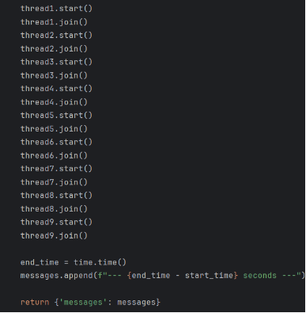
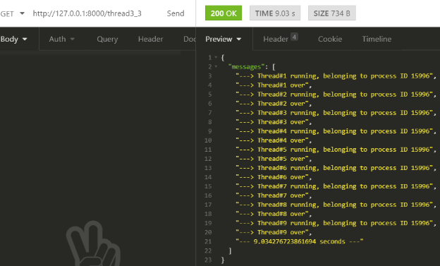
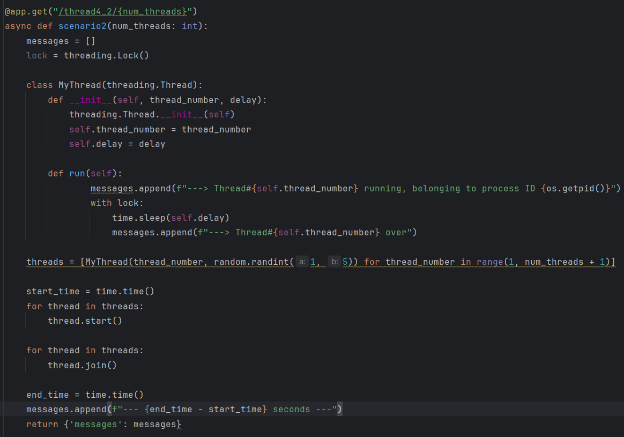
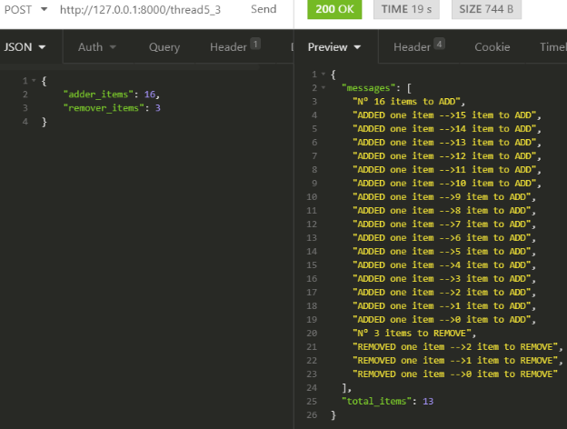
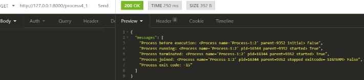
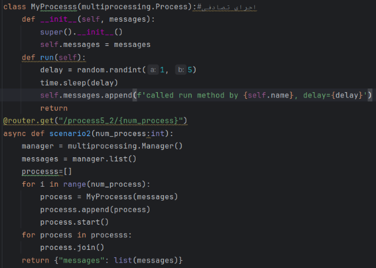
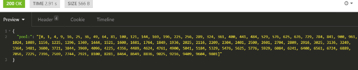
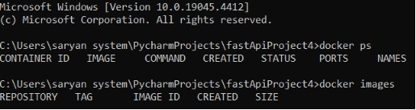
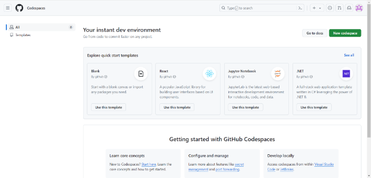
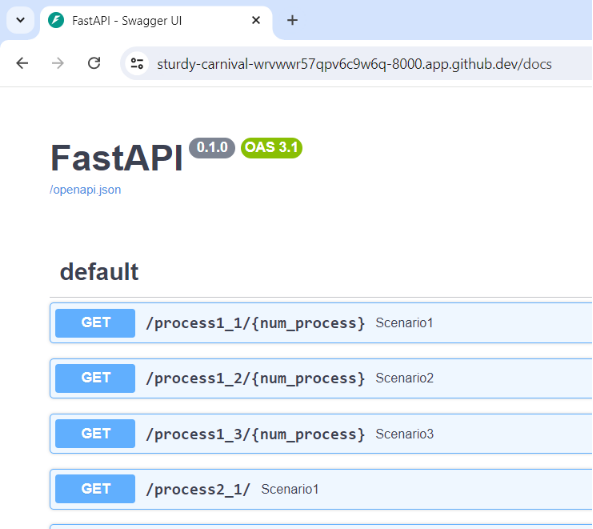

به نام خدا

**پروژه درس پردازش موازی**

دانشجو :

پریسا مبارک

شماره دانشجویی :

40211415006

استاد مربوطه :

دکتر عبدالرضا رشنو

خرداد 1403

در این پروژه سه قسمت داریم:

1. موازی سازی نخ ها
1. موازی سازی فرایندها
1. محاسبات ناهمگن

هدف این هست که موارد زیر را انجام دهیم:

1. برای هر قسمت(که خود شامل مثال های مختلفی هست)، یک API در FastAPI بنویسیم، ورودی ها میتوانند بصورت path ، query  و یا در قالب body ارسال شوند. برای هر قسمت خروجی مناسبی با ساختار JSON ایجاد کنیم.(ساختار ورودی، خروجی API ها کاملا به سلیقه ما بستگی دارد.)
1. پروژه را داکرایز کرده و کانتینرهای لازم برای اجرای پروژه را ایجاد کنیم.
1. از طریق بستر Github فایل های داکرایز شده را از IDE به repository خود push کنیم.
1. یک سرور مجاز ی را برای بازه کوتاهی اجاره کنیم ، کانفیگ کنیم، نیازمندی ها را روی آن نصب کنیم، محتوا ی repository خود را از Github به سرور clone کنیم.
1. کانتینرها را در سرور اجرا کنیم تا همه API ها بصورت عمومی در دسترس قرار گیرند.
1. گزارشی از جزئیات همه مراحل فوق به همراه عکس هر مرحله آماده کرده و در فایل ReadMe  قراردهیم.

**بخش اول: api نویسی**

**قسمت اول:موازی سازی در سطح نخ ها**

این بخش شامل 7 مثال هست. میخواهیم برای هر مثال،3 سناریو مختلف بنویسیم(به صورت api) تا خروجی های متفاوتی داشته باشیم.و در مورد هر سناریو توضیح دهیم که چگونه برای رسیدن به آن خروجی کار می کند.

**مثال اول(تعریف نخ):**

مثال اول به این صورت هست:

در این مثال نخ ها را با استفاده از ایجاد یک شی از thread تعریف میکنم.(روش اول اجرای نخ)

سناریو اول: 

این API تعداد نخ‌ها را به عنوان ورودی از طریق مسیر (path) دریافت می‌کند و پیامی شامل شماره نخ‌ها را بازمی‌گرداند. 

در این سناریو تابع my\_func تعریف شده است که یک  thread\_number (شماره نخ) به عنوان ورودی می‌گیرد و پیامی چاپ می‌کند.

\- لیستی به نام threads ایجاد می‌شود تا نخ‌هایی که ایجاد میکنیم را نگهداری کند.

\- با یک حلقه for، ۱۰ نخ (هر تعدادی که در path دادیم) ایجاد می‌شوند. هر نخ باید تابع my\_func را با شماره نخ متناظر خود اجرا کند.

\- بعد از ایجاد همه نخ‌ها، با استفاده از یک حلقه دیگر،  نخ ها (به همان ترتیبی که ایجاد شده اند) اجرا و تمام میشوند. درواقع به علت وجود join بعد از start، اجرای هر نخ قبل از اجرای نخ بعدی به اتمام میرسد.

خروجی :

سناریو دوم:

در سناریو دوم میخواهم ترتیب اتمام نخ ها را بصورت رندوم تعیین کنم. درواقع لزوما نخ ها به ترتیبی که ایجاد و اجرا شده اند، به اتمام نرسند . این کار را با گذاشتن sleep انجام دادم. تغییراتی که در کد قبل اعمال کردم به این صورت هست:  start  را بلافاصله بعد از ایجاد هر نخ گذاشتم و sleep را بصورت رندوم قبل از چاپ پیغام مربوط به هر نخ، گذاشتم. 

بااین کار، ابتدا تمام نخ ها ایجاد و شروع به اجرا میکنند اما به علت وجود sleep قبل از چاپ پیغام، هر نخی که زمان sleep کمتری دارد، زودتر از انتظار در می آید و پیغامش را چاپ میکند. درواقع در این سناریو نخ ها به ترتیب زمان sleep (از کم به زیاد)، به اتمام میرسند.

سناریو سوم:

در این سناریو میخواهم پیغام مربوط به نخ هارا به ترتیب عکس(یعنی از نخ 9 تا نخ صفر) چاپ کنم.

بنابراین از حلقه forصرف نظر کردم و ونخ هارا جداگانه و با زمان sleep از زیاد به کم، ایجاد کردم:

خروجی:

**مثال دوم(تعیین نخ فعلی):**

مثال دوم به این صورت:

در این مثال نیز نخ ها را با استفاده از ایجاد یک شی از thread تعریف میکنم. 

` `سناریو اول:

در این سناریو میخواهم ابتدا برای نخ A تا نخ  C پیغام شروع چاپ شود و سپس به همان ترتیب پیغام تمام شدن نمایش داده شود. به این صورت که ابتدا نخ اول اجرا میشود و پیغام شروع چاپ میشود و بعد وارد sleep میشود. نخ دوم از زمان sleep نخ اول استفاده میکند و اجرا میشود و پیغام شروع آن هم چاپ میشود و سپس نخ دوم هم وارد sleep میشود. نخ سوم هم از این زمان استفاده کرده و همانند نخ های قبل پیغام شروعش چاپ شده و وارد sleep میشود. حال به ترتیب join ها، پیغام دوم نیز برای نخ های یک تا 3 چاپ میشود.

خروجی:

سناریو دوم:

در این سناریو میخواهم، ابتدا نخ A شروع و تمام شود و سپس نخ دوم شروع و تمام شود و سپس نخ سوم شروع و تمام شود. بنابراین برای هر نخ، بعد از start ، join را مینویسیم:

خروجی:

سناریو سوم:

در این سناریو میخواهم ابتدا نخ اول چاپ شود و به اتمام برسد و سپس پیغام شروع برای نخ دوم و سوم نمایش داده شود و بعد پیغام اتمام برای نخ دوم و سوم چاپ شود:

خروجی:

**مثال سوم(تعریف زیر کلاس نخ):**

در این مثال از یک زیر کلاس برای اجرای نخ استفاده میکنیم.( روش دوم اجرای نخ)

سناریو اول:

در این سناریو میخواهم تعداد نخ ها را از ورودی(از طریق PATH) بگیرد و خروجی همانند تصویر بالا شود. به این صورت که ابتدا نخ ها به صورت رندوم شروع به اجرا میکنند(یعنی در مرحله اول، پیغام اول نخ ها به صورت رندوم چاپ میشود) و سپس به صورت رندوم به اتمام میرسند(یعنی در مرحله دوم، پیغام دوم نخ ها به صورت رندوم چاپ میشود). در نهایت پیغام END چاپ میشود و زمان صرف شده نمایش داده میشود.

بنابراین ابتدا یک کلاس تعریف میکنیم که از کلاس THREAD ارث بری میکند.

در این کلاس دوتابع داریم:

تابع INIT: این تابع مقادیر اولیه برای ایجاد شی را تخصیص میدهد. در این تابع دو پارامترورودی تعریف میکنیم: شماره نخ و زمان تاخیر برای نخ.

تابع RUN: این تابع، یک تابع پیشفرض به عنوان target برای اجرای آن نخ هست. در این تابع دو پیغام شروع نخ و اتمام نخ چاپ میشود. برای اینکه چاپ پیغام شروع برای نخ ها ، تصادفی شود، قبل از آن یک زمان تاخیر رندوم بین یک تا 3 گذاشتم. و برای اینکه چاپ پیغام اتمام برای نخ ها ، تصادفی شود، قبل از آن یک زمان تاخیر رندوم بین 4 تا 6 گذاشتم.

در ادامه به هر تعدادی که در ورودی مشخص میکنیم(از طریقpath)، نخ ایجاد میکنیم. در زمان ایجاد نخ حتما باید دو پارامتر شماره نخ(شماره نخ ها از یک تا تعداد مدنظر می باشد) و زمان تاخیر برای آن نخ(همان زمان تاخیر رندوم بین 4تا 6 که مطرح کردم. درواقع زمان تاخیری که در هنگام ایجاد نخ به عنوان پارامتر ورودی میدهیم، همان زمان sleep دوم در تابع run میباشد) را مشخص کنیم. 

در ادامه در یک حلقه for، نخ ها را start میکنیم. سپس در حلقه for دوم، منتظر اتمام نخ ها میمانیم .

در نهایت زمان محاسبه و چاپ میشود. 

خروجی:

سناریو دوم:

در این سناریو میخواهم ابتدا پیغام شروع برای 5 نخ اول به ترتیب چاپ شود و بعد پیغام اتمام آن ها نیز به ترتیب چاپ شود. در ادامه نیز پیغام شروع برای 4 نخ دوم به ترتیب چاپ شده و سپس پیغام اتمام برای آن ها نیز به ترتیب نمایش داده شود.

برای اینکار 5 نخ اول را ابتدا ب ترتیب start کردم و سپس ب ترتیب join کردم. در ادامه همینکار را برای 4 نخ دوم انجام دادم.

برای اطمینان از اینکه نخ ها دقیقا باهمان ترتیبی که نوشتم به اتمام میرسند زمان تاخیر 5نخ اول را از کم به زیاد گذاشتم. همچنین برای 4 نخ دوم نیز همین کار را کردم. و از آن زمان تاخیر ، قبل از چاپ پیغام  اتمام نخ ها، استفاده کردم.

خروجی:

سناریو سوم:

در این سناریو میخواهم هر نخ پس از به اتمام رسیدن نخ قبلی، اجرا شود. بنابر این بعد از هر start، join گذاشتم:

خروجی:

**مثال چهارم(** **همگام سازی نخ با قفل):**

در این مثال از ابزار lock استفاده میکنیم.

سناریو اول:

در این سناریو میخواهم خروجی همانند تصویر بالا شود. یعنی هر نخ بعد از اتمام نخ قبلی، اجرا شود. در سناریو سوم مثال قبل، این کار را از طریق گذاشتن start  و join برای هر نخ بصورت دقیقا متوالی، انجام دادم. در این مثال این کار را از طریق ابزار lock انجام میدهم. به این صورت که هر نخ ابتدا قفل را میگیرد و پیغام های شروع و پایانش را چاپ میکند و سپس قفل را آزاد میکند. بااین کار به عنوان مثال زمانی که نخ اول قفل را میگیرد و پیغام اول را چاپ میکند و وارد sleep میشود، نخ دوم از این زمان sleep استفاده میکند و آن نیز میخواهد قفل را بگیرد اما چون نخ اول قبلا آن نخ را گرفته وآزاد نکرده است، نخ دوم نمیتواند قفل را بگیرد و باید تا زمان آزاد شدن قفل توسط نخ اول منتظر بماند. پس نخ دوم منتظر مانده و نخ اول بعد از گذرندان زمان sleep خود، پیغام دوم را نیز چاپ میکند و قفل را آزاد میکند. حال نخ دوم قفل را میگیرد و کارهای لازم را انجام داده و قفل را آزاد میکند و........

در کد زیر با گرفتن تعداد نخ ها این کار را از طریق with  و lock انجام میدهیم:

خروجی:

سناریو دوم:

در این سناریو میخواهم ابتدا پیغام اول برای همه نخ ها به ترتیب چاپ شود. سپس پیغام دوم برای همه نخ ها به ترتیب چاپ شود.

برای اینکار از ابزار lock بعد از چاپ پیغام اول استفاده میکنم. 

ابتدا همه نخ ها شروع به اجرا میکنند و پیغام اول چاپ میشود.در ادامه نخ ها به همان ترتیبی که اجرا شده اند میخواهند lock را بگیرند. پس ابتدا نخ اول قفل را گرفته و عملیات انتظار و چاپ پیغام دوم را انجام میدهد. در این زمان نخ های دیگر در صف گرفتن قفل هستند و وقتی نخ اول به اتمام رسید، نخ دوم قفل را میگیرد و..... . پس با گذاشتن lock توانستیم کاری کنیم که پیغام دوم نیز به ترتیب چاپ پیغام اول، چاپ شود. (قبلا به جای ابزار lock از گذاشتن زمان sleep از کم به زیاد، این کار را میکردیم):

خروجی:

سناریو سوم:

در این سناریو میخواهم پیغام اول برای تمام نخ ها به صورت رندوم چاپ شود. سپس پیغام دوم دقیقا به همان ترتیب تصادفی قبل، چاپ شود.

این سناریو شبیه به سناریو اول مثال سوم هست بااین تفاوت که با گذاشتن lock قبل ازsleep دوم، کاری میکنیم که ترتیب اتمام نخ ها مشابه ترتیب اجرای آن ها باشد. درواقع نخ ها به ترتیبی که اجرا میشوند و پیغام اول را چاپ میکنند، به همان ترتیب، برای گرفتن قفل درخواست میدهند. بنابراین هرکس زودتر قفل را بگیرد، زودتر پیغام اتمام را چاپ میکند و قفل را آزاد میکند و نخ بعدی قفل را میگیرد و....

خروجی:

**مثال پنجم(همگام سازی نخ با RLlock):**

در این مثال از ابزار Rlock استفاده میکنیم.

سناریو اول:

در این سناریو دو ورودی از طریق body میگیریم. این دو ورودی، تعداد دفعات add کردن و تعداد دفعات remove هست. در ابتدا مقدار اولیه موجودی صفر میباشد و سپس به تعداد ورودی هایی که مشخص کردیم، به صورت یک در میان، add و remove انجام داده میشود.

توضیح مختصری از بخش‌های مختلف کد:

- Items

این کلاس با استفاده ازBaseModel از پکیج pydantic تعریف شده است.

این کلاس دارای دو ویژگی است: adder\_items و remover\_items که مقدار موجودی اضافه شده و کاهش یافته را مشخص می‌کنند.

- Box

این کلاس شامل چهار تابع init و  execute و add وremove میباشد. توابع add و remove ابتدا قفل را میگیرند و سپس تابع execute را فرا خوانی میکنند. در تابع execute نیز ابتدا قفل گرفته میشود و سپس عمل افزایش یا کاهش را انجام میدهد. 

- adder() و remover()

این دو تابع به ترتیب برای افزودن و کاهش موجودی استفاده می‌شوند.

هر تابع با استفاده از یک حلقه موجودی را به‌روز می‌کند و پیام‌های مربوطه را به لیست messages اضافه می‌کند.

در ادامه دو نخ (thread) برای افزودن و کاهش موجودی ایجاد می‌شوند و به‌طور همزمان اجرا می‌شوند. ابتدا نخ اول تابع adder و تابعadder  نیز تابع add از کلاس box وتابعadd نیزتابع execute(1)  را فراخوانی میکند. به همین ترتیب نخ دوم هم توابع مورد نظر را فراخوانی میکند. وقتی نخ اول توابع add و excute را فراخوانی میکند دوبار قفل را میگیرد(به علت استفاده از rlock هر نخ میتواند چندین بار قفل را بگیرد و نخ دیگر باید صبر کند که نخ قبل به اندازه گرفتن ها، قفل را آزاد کند و سپس میتواند قفل را (به هر تعداد )بگیرد). بنابراین نخ دوم باید تا دوبار آزاد کردن قفل توسط نخ اول صبر کند.

این کار باعث میشود که هر عمل افزایش وکاهش به طور کامل انجام بشوند. 

همچنین استفاده از sleep(1) ، باعث تضمین اجرای یک در میان adder و remover میشود.

بعد از اتمام کار دو نخ، مجموع موجودی و لیست پیام‌ها بازگردانده می‌شود.

خروجی:

سناریو دوم:

در سناریو دوم میخواهم به جای اجرا یک در میان توابع افزایش و کاهش، تعداد دفعات افزایش بیشتر از کاهش باشد به این صورت که بعد از هر سه بار افزایش، یک بار کاهش داشته باشیم. برای مشاهده و درک بهتر خروجی، تعداد دفعات کاهش را بیشتراز یک انتخاب کردم. کد را دقیقا مشابه سناریو اول نوشتم بااین تفاوت که زمان sleep برای تابع کاهش  را 3 گذاشتم:

خروجی:

سناریو سوم:

در این سناریو میخواهم ابتدا افزایش ها انجام شوند. سپس کاهش ها انجام شوند. بنابراین کد را مشابه سناریو اول مینویسم با این تفاوت که نخ دوم را بعد از اتمام نخ اول اجرا میکنم به این صورت:

خروجی:

**مثال ششم(همگام سازی نخ با سمافورها):**

در این مثال میخواهیم از سمافور ها استفاده کنیم.

سناریو اول:

در این سناریو میخواهم تولید و مصرف به صورت یک در میان اجرا شود. 

دو نخ ایجاد میکنیم. نخ اول مصرف کننده و نخ دوم تولید کننده هست.t1 زمانی میتواند مصرف کند که t2 قبل از آن تولید کرده باشد. 

ابتدا مصرف کننده اجرا میشود و چون آیتم خالی است(semaphore=0)، به حالت انتظار میرود. سپس تولید کننده تولید میکند(سمافور را آزاد میکند وsemaphore=1) بااینکار مصرف کننده از حالت انتظار خارج میشود و مصرف میکند. تا اینجا یک بار تولید و یکبار مصرف شده است. حال این مراحل دوباره تکرار میشوند. تعداد تکرار ها را به عنوان ورودیدر body مشخص میکنیم. بنابراین تعداد تکرار ها، تعداد دفعاتی که یک آیتم تولید وبلافاصله مصرف میشود را نشان میدهد.

در کد زیر توابع join در هر تکرار، اتمام t1 و t2 را قبل از تکرار بعدی تضمین میکند.

با این کارتولید و مصرف به صورت یک در میان انجام میشود:

خروجی:

سناریو دوم:

در این سناریو با برداشتن join ها، چون t2 زمان sleep بیشتری نسبت به t1 دارد، t1 همیشه در انتظار t2 میماند. یعنی مدام (به اندازه تعداد مراحل)، پیغام انتظار t1 (مصرف کننده)چاپ میشود:

خروجی:

سناریو سوم:

در این سناریو میخواهم t2 را به صورت متوالی اجرا کنم و نشاه دهم که اجرای متوالی t2 باعث از دست رفتن محتواب item قبل از مصرف شدن توسط t1 میشود. برای اینکار ابتدا t2 را کامل اجرا میکنم و سپس t1 را کامل اجرا میکنم:

خروجی:

**مثال هفتم(همگام سازی نخ با barrier):**

در این مثال میخواهیم از ابزار barrier استفاده کنیم.

سناریو اول:

در این سناریو یک مسابقه بین سه دونده شبیه‌سازی می‌شود. هر دونده بعد از یک تأخیر تصادفی به یک مانع (Barrier) می‌رسد و سپس منتظر می‌ماند تا همه دوندگان برسند. پیام‌های مربوط رسیدن هر دونده به مانع جمع‌آوری و در خروجی API برگردانده می‌شوند.

در ادامه توضیح مختصری از کد میدهم:

در ابتدا متغیر های مربوط به مسابقه مانند تعداد دوندگان،یک مانع  ((Barrier)  که تا زمانی که همه دوندگان به آن نرسند، اجازه عبور نمی‌دهد) و لیستی از نام دوندگان را تعریف و مقداردهی میکنیم.

در یک حلقه for نخ ها را ایجاد و start میکنیم. هر نخ بعد از start تابع runner را فراخوانی میکند.در این تابع ابتدا دونده از آخر لیست برداشته (حذف) میشود و پس از گذرندان زمان لازم(تصادفی)،به مانع میرسد و پیغام دونده به مانع رسیده است،چاپ میشود.در این زمان دونده باید منتظر بماند که دوندگان باقی مانده نیز به مانع برسند.

وقتی اجرای تمام نخ ها به پایان رسید (تمام دوندگان به مانع رسیدند)، پیغام پایان مسابقه چاپ میشود.

به علت زمان تصادفی (زمان sleep برای رسیدن هردونده ب مانع)، چاپ پیغام مربوط به رسیدن دونده به مانع، بر اساس همان زمان تصادفی(از کم به زیاد)میباشد و قابل پیش بینی نیست. 

پس در این سناریو ابتدا تمام دوندگان به یک مانع میرسند(با ترتیب تصادفی) و درنهایت پیغام پایان مسابقه چاپ میشود.

خروجی:(خروجی زیر با ترتیب تصادفی هست و هربار ترتیب خروجی فرق دارد)

سناریو دوم:

در این سناریو میخواهم حتما دونده ای که زودتر شروع میکند، با هر زمان انتظاری هم که دارد(حتی اگر زمان sleep زیاد باشد)، زودتر از بقیه به مانع برسد. و پیغامش چاپ شود. برای اینکار از ابزار lock استفاده کردم. دونده اول قفل را میگیرد و زمانش را سپری میکند و پیغامش را چاپ میکند و بعد قفل را آزاد کرده و به مانع میرسد و صبر میکند بقیه نیز به مانع برسند. در زمانی که دونده قفل را گرفته ولی آزاد نکرده، دونده دیگری نمیتواند قفل را بگیرد و هر دونده ای با هر زمان انتظاری که دارد مجبور هست منتظر رسیدن دونده قبلی به مانع بماند و سپس قفل را بگیرد و.....

خروجی:

سناریو سوم:

در این سناریو میخواهم دوندگان هم زمان به مانع برسند.یعنی چاپ پیغام ها به این صورت باشد که یک زمان را نشان دهد.ابتدا از طریق barrier همه دوندگان به یک جا میرسند.وقتی همه به انجا رسیدند، آنگاه هم زمان از آن حالت انتظار آزاد میشوند و همان لحظه ای که آزاد میشوند را به عنوان زمان رسیدن به مانع در نظر میگیرم و ذخیره میکنم. سپس به نوبت پیغام ها چاپ میشود اما با همان زمانی که قبلا ثبت کردیم و برای همه یکسان هست.به این صورت:

خروجی:

**قسمت دوم:موازی سازی در سطح فرایندها**

**مثال اول(Spawning a process):**

سناریو اول:

در این سناریو میخواهم تعدادی فرایند ایجاد کنم که به ترتیب اجرا شوند و هر فرایند بعد از اتمام فرایند قبلی، اجرا شود. در یک حلقه for هربار یک فرایند ایجاد میکنم و آن را اجرا کرده و به اتمام میرسانم. در مرحله بعد یک فرایند دیگر اجرا کرده و .... .هر فرایند برای اجرا، یک تابع را فراخوانی میکند که آن تابع پیغام هایی نمایش میدهد. درواقع کار آن تابع، این هست که فرایند فعلی را صدا میزند و در ادامه نیز به تعداد 0 تا یک شماره قبل ازشماره فرایند، پیغام هایی را چاپ میکند. 

نکته هایی در باره موازی سازی در سطح فرایند:

چون فرایند ها حافظه مشترکی ندارند بنابراین اگر از manager استفاده نمیکردم در نهایت مشکل پیش می آمد. درواقع با نوشتن دو خط کد زیر:

manager = multiprocessing.Manager()
messages = manager.list()

توانستم مشکل عدم به اشتراک گذاری لیست messages بین فرایند های فرزند را برطرف ‌کنم.

کد این سناریو به این صورت هست:

خروجی:

سناریو دوم:

در این سناریو میخواهم فرایندها به طور تصادفی اجراشوند.اما هرفرایند ، به طور کامل اجرا میشود یعنی پیغام های مربوط ب هر فرایند پشت سر هم میباشد. برای این کار، جوین ها را در حلقه جداگانه گذاشتم:

خروجی:

سناریو سوم:

در این سناریو میخواهم بازهم اجرا تصادفی باشد اما بااین تفاوت که ابتدا به طور تصادفی پیغام های اول چاپ شود. بعد از آن به طور تصادفی پیغام های دوم چاپ شود. این کار را با گذاشتن sleep به صورت رندوم، قبل از چاپ پیغام دوم انجام دادم:

خروجی:

**مثال دوم(نام گذاری فرایند):**

سناریو اول:

در این سناریو میخواهم خروجی همانند تصویر بالا شود یعنی ابتدا پیغام اول فرایندها چاپ شود و سپس پیغام دوم آن ها چاپ شود(به علت وجود sleep). در این کد از پارامترname برای فرایند اول استفاده میکنم و با این کار فرایند را نام گذاری میکنم. حالا فرایند دوم که نام گذاری نشده، یک نام پیشفرض به آن تخصیص می یابد:

خروجی:

سناریو دوم:

در این سناریو میخواهم هر فرایند بعد از اتمام فرایند قبلی اجراشود. بنابراین بعد از هر start، join میگذارم.(البته میتوانم به جای این کار، sleep را حذف کنم):

خروجی:

سناریو سوم:

در این سناریو میخواهم ابتدا پیغام اول فرایند ها چاپ شود. سپس پیغام دوم فرایند دوم چاپ شود و بعد پیغام دوم فرایند اول. برای اینکه حتما فرایند دوم زودتر از فرایند اول پایان یابد، از زمان sleep کمتری برای فرایند دوم نسبت به فرایند اول استفاده کردم. این زمان sleep را به عنوان آرگومان به تابع مورد نظر دادم.پس فرایندها پیغام اول را چاپ میکنند و منتظر میمانند. انتظار فرایند دوم زودتر تمام میشود چون زمان انتظارش کمتر است و زود تر پیغام نهایی خود را چاپ میکند.

خروجی:

**مثال سوم(اجرای فرآیندها در background):**

ما در اجرای فرایند ها پارامتری بنام daemon داریم.در این مثال میخواهیم از این پارامتر استفاده کنیم. اگر daemon مقدار true داشته باشد یعنی فرایند، غیر تعاملی هست و اگر خروجی داشته باشد، به کاربر نمایش نمیدهد. اما اگر false باشد فرایند تعاملی هست و خروجی ها به کاربر نمایش داده میشوند.

سناریو اول: 

در این سناریو میخواهم پارامتر daemon را برای یک فرایند true بگذارم و برای دیگری false بگذارم. هر دو فرایند یک تابع را فراخوانی میکنند و مشاهده میکنیم که فقط خروجی های فرایندی که پارامتر daemon آن false هست نمایش داده میشود.

خروجی:

سناریو دوم:

این سناریو را برعکس سناریو قبلی اجرا میکنم به این صورت که دایمون فرایند اول را true میدهیم و دایمون پارامتر دوم را false. همانطور که مشاهده میکنیم، فقط خروجی فرایند دوم را نمایش میدهد:

خروجی:

سناریو سوم:

در این سناریو میخواهم پارامتر daemon هر دو فرایند را false کنم و مشاهده میکنیم که خروجی های هر دو فرایند نشان داده میشود:

خروجی:

**مثال چهارم(اتمام یک فرایند):**

در این مثال از دستور terminate برای خاتمه دادن به یک فرایند استفاده میشود.

سناریو اول:

در این سناریو میخواهم بلافاصله بعد از اجرای یک فرایند، آن را terminate کنم یعنی فرایند را خاتمه دهم. برای این کار این دستور را بلافاصله بعد از start و بلافاصله قبل از join گذاشتم. در نهایت نیز از دستور exitcode برای نشان دادن وضعیت خروج از برنامه استفاده کردم. هممچنین برای نشان دادن وضعیت برنامه در هر لحظه از دستور is\_alive استفاده کردم.اگر trueباشد یعنی برنامه در حال اجرا هست در غیر این صورت false میباشد.

ابتدا فرایند را ایجاد میکنیم و در آن زمان وضعیت را با دستور is\_alive مشاهده میکنیم. درواقع وضعیتی که چاپ شده false هست و قابل انتظار بود چون برنامه در حال اجرا نیست. سپس فرایند را اجرا میکنیم و دوباره وضعیت را چاپ میکنیم که true میباشد. بعد از آن فرایند را خاتمه میدهیم و بلافاصله وضعیت را مشاهده میکنیم که true هست. علت اینکه false نشده این هست که بعد از دستور terminate برنامه بلافاصله خاتمه نمی یابد و باید چن لحظه بگذرد تا برنامه خاتمه یابد و وضعیت false شود. سپس فرایند را join کرده و بلافاصله وضعیت را میبینیم که false شده است و علت این هست که با دستورjoin برنامه منتظر میماند که فرایند کاملا تمام شود. در پایان با دستور exitcodeکد خروج را مشاهده میکنیم که منفی هست. کد خروج منفی به معنای این هست که برنامه بتا یک عامل دیگر(در اینجا terminate)به پایان رسیده است.

خروجی:

سناریو دوم:

در این سناریو میخواهم با گذاشتن sleep بلافاصله بعد از terminate در خروجی مشاهده کنم که وضعیت بعد از terminate برابر با false شده است. یعنی بعد از خاتمه دادن به فرتیند، باید کمی صبر کنیم که فرایند واقعا خاتمه یابد.

خروجی:

سناریو سوم:

در این سناریو با گذاشتن زمان sleep قبل از terminate کردن، مقداری از پیغام های تابع foot نیز اجرا میشود در واقع به فرایند فرصت میدهم که کمی اجرا شود:

خروجی:

**مثال پنجم(تعریف فرآیندها در یک زیر کلاس):**

در این مثال یک زیر کلاس از کلاس multiprocessing.process ایجاد میشود که برای اجرا به run شاره میکند.

سناریو اول:

در این سناریو میخواهم خروجی همانند تصویر بالاشود. برای این کار، ابتدا تعداد فرایندهایی که میخواهم ایجاد کنم را به عنوان ورودی از طریقpath دریافت میکنیم. طبق کد زیر در هر تکرار، یک فرایند از کلاس myprocrss ایجاد میشود. سپس فرایند را اجرا میکنیم و تا زمانی که فرایند به اتمام برسد صبر میکنیم. سپس وارد حلقه بعد میشویم و یک فرایند دیگر ایجاد میشود و .... . هر فرایند که اجرا میشود، در واقع کلاس myprocess برای آن فراخوانی میشود و تابع run موجود در این کلاس برای آن فرایند اجرا میشود. بنابراین برای هر فرایند یک پیغام چاپ میشود.

خروجی:

سناریو دوم:

در این سناریو میخواهم ترتیب اجرای فرایند ها تصادفی شود. این کار را با گذاشتن sleep با مقدار رندوم قبل از چاپ پیغام انجام میدهم و همچنین join ها را بعد از start ها و در یک حلقه جداگانه میگذارم. در خروجی مشاهده میکنیم که پیغام ها بر اساس زمان انتظار(از کم به زیاد) نمایش داده شده اند:

خروجی:

سناریو سوم:

در این سناریو، اجرا به ترتیب هست و میخواهم نشان دهم که اگر زمان انتظار تصادفی بگذارم اما برای هرفرایند،هم چنان هرjoin بعد از start باشد باشد، هیچ تاثییری جز افزایش زمان اجرا ندارد و خروجی همان هست. درواقع در این سناریو ، api سناریو اول و تابع سناریو دوم را ترکیب کردم و مشاهده میکنیم که با وجود sleep های متفاوت، هم چنان چاپ پیغام ها به ترتیب هست.

**مثال ششم(استفاده از صف برای تبادل داده):**

در این مثال میخواهیم برای تبادل داده از صف(queue) استفاده کنیم.

سناریو اول:

در این مثال میخواهیم به تعداد 10 تا آیتم تولید و مصرف کنیم. در این سناریو میخواهم خروجی همانند تصویر بالا شود یعنی بعد از 2 الی 3 تولید، یک مصرف داشته باشیم. این روال تا زمانی که ده تا آیتم تولید شوند، ادامه داشته باشد و پس از آن همه آیتم های باقی مانده مصرف شوند.

برای این کار از صف استفاده میکنیم. تولید کننده هر آیتمی تولید میکند از طریق دستور put در صف میگذارد. این صف بین تولید کننده و مصرف کننده مشترک میباشد. مصرف کننده نیز از طریق دستور get آیتمی که زودتر از بقیه وارد شده است را بر میدارد. 

اگر مصرف کننده قبل از تولید کننده اجرا شود،یا در حین اجرا برای تولید کننده، وقفه ای ایجاد شود که باعث خالی شدن صف شود، مصرف کننده برای همیشه ازاجرا خارج میشود و همه آیتم های تولید شده بعد از آن بدون مصرف باقی میمانند. در این سناریو با زمان اجرای sleep بیشتر برای مصرف کننده(2ثانیه)، این مشکل حل شده است.

سناریو دوم:

در این سناریو میخواهم تولید کننده و مصرف کننده به صورت یک در میان اجرا شوند اما نه به طور کامل. درواقع هر زمانی که مصرف کننده زودتر از تولیدکننده اجرا شود، مصرف کننده برای همیشه از اجرا خارج میشود و دیگر مصرف نمیکند و از آن پس فقط تولید اتفاق می افتد.بنابراین علاوه بر این حالت، ممکن هست مصرف کننده زودتر اجراشود و باعث شود فقط تولیدکننده تولید کند و یا حتی ممکن هست اصلا همچین اتفاقی نیفتد و مصرف کننده همیشه بعد از تولید کننده اجرا شود و تمام آیتم ها یک در میان تولید و مصرف شوند.

این کاررا با حذف sleep2 ثانیه ای مربوط به مصرف کننده انجام دادم. 

همانطور که در خروجی و در خط آخر نیز مشاهده میکنیم در نهایت تعدادی آیتم در صف باقی ماندند ومصرف نشدند.

خروجی:

سناریو سوم:

در این سناریو میخواهم ابتدا تولیدکننده تمام آیتم ها را تولید کند و بعد از آن مصرف کننده آیتم ها را به ترتیب مصرف کند(هر آیتمی که زودتر وارد صف شده زودتر هم مصرف میشود).

برای این کار در api مربوط به سناریو اول یک تغییر ایجاد میکنیم. join تولید کننده را قبل از start مصرف کننده مینویسیم.

خروجی:

**مثال هفتم(همگام سازی فرآیندها):**

در این مثال میخواهیم از barrier استفاده کنیم. Barrier باعث میشود فرایندها در یک زمان قرار گیرند. درواقع فرایندها در یک زمان از یک مانع آزاد شوند. Barrier(n) یعنی زمانی اجازه عبور میدهد که n فرایند آن را آزاد کرده باشند.

سناریو اول:

در این سناریو میخواهم خروجی همانند تصویر بالا شود. یعنی 4 فرایند داریم که در فرایند اول و دوم یک محدودیت اعمال میکنیم(از طریق barrier) اما برای فرایند سوم و چهارم هیچ محدودیتی نمیگذاریم. 

فرایند سوم و چهارم هیچ محدودیتی ندارند و به راحتی اجرامیشوند. فرایند دوم و سوم نیز که اجرا میشوند، زمانی که به synchronizer.wait() میرسند، باید صبر کنند که دیگری نیزآن را اجرا کنند. (چون synchronizer را برابر با barrier(2) گذاشتم). پس barrier(2).wait یعنی باید دو فرایند به مانع برسند تا هر دو از حالت انتظار خارج شوند.

پس وقتی دو فرایند به barrier(2).wait رسیدند، آزاد شده و وارد خط بعد میشوند. بنابراین در خط بعد زمان برابر برای هردو فرایند ثبت میشود.

در خط بعد از ابزار lock استفاده شده است و از آن طریق برای چاپ پیغام های دو فرایند اول و دوم، اجازه اجرای همزمان داده نمیشود. یعنی هر فرایندی که زودتر اجرا میشود، زودتر قفل را میگیرد و پیغام را چاپ میکند و قفل را آزاد میکند و نوبت به فرایند بعد میشود و ... .

بنابراین طبق خروجی مشاهده میکنیم که فرایند سوم و چهارم زمان برابر ندارند اما فرایند اول و دوم زمان برابر دارند.

خروجی:

سناریو دوم:

در این سناریو میخواهم برای هر 4 فرایند زمان یکسانی ثبت شود. برای اینکار پارامتر ورودی barrier را 4 میدهیم و target مربوط به 4 فرایند را برابر با تابع test\_with\_barrierr  میگذاریم:

خروجی:

سناریو سوم:

در این سناریو میخواهم فرایند اول و دوم هم زمان باشند و فرایند سوم و چهارم نیز هم زمان باشند. برای اینکار پارامتر barrier را 2 میدهم و start فرایند سوم و چهارم را بعد ازjoin های دو فرایند اول میگذارم. بااینکار ابتدا فرایند اول و دوم اجرا شده و به علت وجود barrier زمان برابر برای آن ها ثبت میشود و سپس دو فرایند دوم اجرا شده و همان اتفاق قبلی برای این دو فرایند نیز می افتد.

خروجی:

**مثال هشتم(استفاده از pool):**

در این مثال میخواهیم از pool استفاده کنیم. Pool یک فضا هست که حاوی داده هایی میباشد که قرار است آن ها را به صورت موازی اجرا کنیم.

سناریو اول:

در این سناریو میخواهیم اعداد  0 تا 99 را از طریق pool و map به توان دو برسانیم.

به این صورت که اعداد 0 تا 99 را در متغیر input میگذاریم.سپس یک pool تعریف میکنیم که شامل 4  پردازشگر هست. سپس از طریق دستورpool.map برای هر کدام از ورودی هایی که داریم، تابع function\_square را فراخوانی میکنیم(تابع function\_square یک عدد را میگیرد و آن را به توان دو میرساند). درواقع دستور pool.map تابع function\_square را برروی هر عدد در لیست inputs به صورت موازی اجرا میکند و نتایج را در pool\_outputs ذخیره میکند. به این ترتیب اعداد 0 تا 99 به توان دو میرسند.

خروجی:

سناریو دوم:

در این سناریو میخواهم اعداد صفر تا 9 را به علاوه 10 کنم.به روشی که در سناریو قبل توضیح دادم کد زیر ، از طریق pool.map این کار را میکند:

خروجی:

سناریو سوم:

در این سناریو میخواهم حرف اول تعدادی رشته را از طریق دستور pool.map برگردانم. برای این کار همانند سناریوهای قبل یک تابع تعریف میکنم که یک رشته را به عنوان ورودی میگیرد و حرف اول آن را برمیگرداند. سپس یکpool تعریف میکنیم که شامل 4 پردازشگر میباشد. در ادامه از طریق دستور pool.map تابع گفته شده را بر روی رشته ها ،بصورت موازی اعمال میکند. در نهایت خروجی را که شامل حرف اول رشته های ورودی میباشد، بصورت رشته به ما نمایش میدهد:

خروجی:

**بخش دوم: Dockerize کردن پروژه**

ما برای داکرایز کردن پروژه خود باید 3 فایل در کنار فایل های پروژه ایجاد کنیم :

Dockerfile :

فایل Dockerfile برای ساخت یک تصویر داکر سفارشی استفاده میشود که شامل برنامه ی ما و محیط اجرایی آن است. تصویر ساخته شده میتواند بر روی سیستمهای مختلف تکرار شود و برنامه ما را در یک محیط مستقل و قابل حمل اجرا کند. این فایل را مطابق تصویر زیر ایجاد کردم :

فایل docker-compose.yml:

در این فایل تمام کانتینرها وتنظیمات آن ها که پروژه ما نیاز دارد مشخص میشود. بنابراین یک کانتیرنر 

app  که پروژه اصلی هست را ایجاد میکنیم. این فایل را به صورت زیر تشکیل دادم :

فایل requirements.txt :

در این فایل تمام پکیج های مورد نیاز برای انجام پروژه را مشخص میکنیم :

ابتدا با وارد کردن دستورات زیر به ترتیب Container های فعال و image ها را مشاهده میکنیم:

حال image های لازم را دانلود و نصب میکنیم :

دانلود image پایتون:

دانلود image با نام  hello-world:

دانلود image با نام  busybox :

حال تمام image ها را مشاهده میکنیم: 

در مرحله بعد با استفاده از دستور زیر تمام container ها را همزمان باهم اجرا میکنیم و درواقع پروژه را داکرایز میکنیم:

حال میتوانیم با استفاده از دستورات زیر، container  های در حال اجرا و همچنین image ها را مشاهده کنیم :

حال اگر دستور زیر را وارد کنیم مشاهده میکنیم که برنامه هیچ اروری ندارد و بنابراین باید اجرا شود:

سپس برای تست از طریق برنامه insomnia یک api را اجرا میکنیم.همانطور که مشاهده میکنیم، برنامه در پایچارم، run نیست اما  در insomnia اجرا میشود:

بنابراین پروژه ی ما به درستی داکرایز شده است. همچنین میتوانیم به داکیومنت پروژه نیز دسترسی داشته باشیم:

**بخش سوم:استفاده از ابزار github :**

در این بخش میخواهیم پروژه ای که ایجاد کرده ایم را وارد github کنیم. درواقع هدف این است که فایل های داکرایز شده را از IDE به repository خود در گیت هاب، push کنیم. بنابراین ابتدا وارد سایت زیر شده و روی گزینه new repository کلیک میکنیم: 

در صفحه باز شده نام ریپازیتوری خود و سایر مشخصات را مشخص میکنیم و در نهایت روی create repository کلیک میکنیم. با این کار یک ریپازیتوری به نام fastapi1 ایجاد کردیم :

در ادامه اگر روی بخش code کلیک کنیم، لینک ریپازیتوری ساخته شده در گیت هاب را مشاده میکنیم. سپس این لینک را کپی میکنیم:

در ادامه مطابق تصویر زیر، در ترمینال پروژه(ترمینال محیط پایچارم یا از طریق command prompt) دستور” لینک کپی شده git clone " را وارد میکنیم:

در ادامه مشاده میکنیم که در پوشه پروژه، یک پوشه گیت هاب بنام fastapi1 ایجاد شده است. سپس تمام فایل های پروژه را وارد پوشه ی ایجاد شده میکنیم:

سپس از طریق کلیک روی نام پروژه(در بالای صفحه) وارد صفحه ای همانند تصویر زیر میشویم و مسیر فایل main.py را درست میکنیم: 

در ادامه در ترمینال، وارد مسیر fastapi1 میشویم:

سپس دستور git add . را وارد میکنیم.بااینکار تغییرات را اضافه میکنیم:

در ادامه با دستور زیر تغییرات را ثبت کرده و برای آن یک نام هم تعیین میکنیم:

سپس از طریق دستور زیر git ساخته شده را به ریپازیتوری خود درگیت هاب منتقل میکنیم:

در ادامه با زدن روی لینک تصویر بالا، وارد ریپازیتوری خود در گیت هاب میشویم و فایل های پروژه ی خود را در این ریپازیتوری مشاهده میکنیم:

نکته: پس از انجام مراحل بالا، به پوشه پروژه در محیط پایچارم برگشتم و پس از run کردن پروژه، ارور زیر را مشاهده کردم: 

و برای رفع این ارور، در فایل main.py همانند تصویر زیر تغییراتی اعمال کردم و ارور رفع شد:

**بخش چهارم:استفاده از سرور :**

ابتدا وارد سایت githubcodespaces میشویم و روی لینک codespaces کلیک میکنیم:

روی گزینه getstarted for free کلیک میکنیم:

روی گزینه new codespaces کلیک میکنیم:

در مرحله بعد ریپازیتوری مورد نظر را انتخاب میکنیم:

سپس گزینه creat codespaces را انتخاب میکنیم:

حال وارد یک محیط جدید (مانند vscod) میشویم. در این محیط به تمام کدهای پروژه دسترسی داریم و میتوانیم در قسمت ترمینال کدها را اجرا کنیم و همچنین میتوانیم کدهارا روی سرور اجرا کنیم.

ابتدا همانند تصویر زیر مشاهده میکنیم که در این محیط هیچ کانتینر و ایمیجی ایجاد نشده است:

اگر دستور docker-compose up –build را در قسمت ترمینال وارد کنیم، ایمیج ها و کانتینرهای لازم ایجاد وسپس اجرا میشوند درواقع پروژه داکرایز میشود. ( نکته:  docker-compose up --build ابتدا تصاویر (images) را می‌سازد و سپس کانتینرها را اجرا می‌کند.

` `docker-compose up -d  فقط کانتینرها را در پس‌زمینه (background) اجرا می‌کند بدون اینکه تصاویر را دوباره بسازد.) :

حال پروژه داکرایز شده و ایمیج ها و کانتینرها را مشاهده میکنیم:

حال وارد قسمت port میشویم و لینک قسمت forwarded address  را کپی میکنیم(قبل از آن قسمت visibility را public میکنیم. برای این کار روی آن کلیک راست کرده و public را انتخاب میکنیم):

اگر لینک را در مرورگر وارد کنیم و انتهای آن /docs را وارد کنیم، داکیومنت پروژه را مشاهده میکنیم:

حال اگر لینک کپی شده را در insomnia وارد کنیم و انتهای آن url مربوط به api را وارد کنیم و send را بزنیم، مشاهده میکنیم که پروژه روی سرور اجرا میشود:

